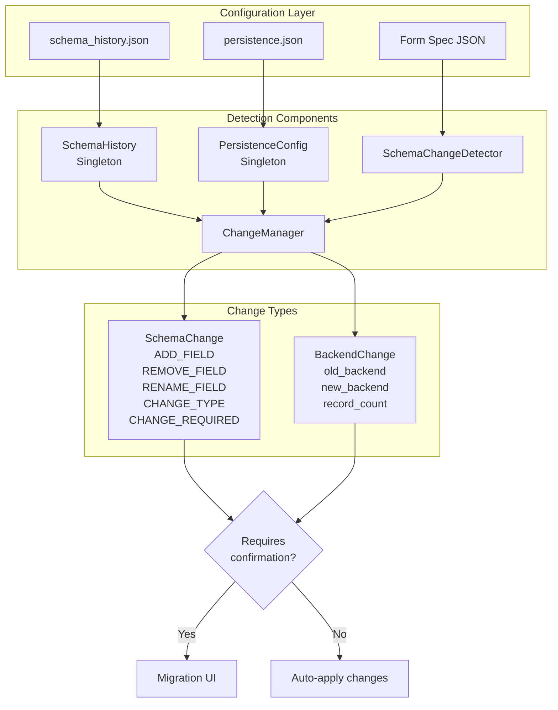

# VibeCForms Architecture

## Overview

VibeCForms is a Flask-based web application implementing a **Model-View-Controller (MVC)** architecture with a sophisticated **multi-backend persistence layer**. The system uses **Repository**, **Adapter**, **Factory**, and **Singleton** design patterns to enable dynamic form generation and flexible data storage.

**Core Philosophy**: Convention over Configuration, Configuration over Code

This creates a development hierarchy where builders use:
1. **Convention** - Well-defined patterns that require no setup
2. **Configuration** - JSON files when customization is needed
3. **Code** - Only for truly unique business logic

---

## Core Architectural Pattern: Cork Board

### Pattern Classification
VibeCForms implements the **Cork Board Pattern**, enabling multi-actor collaboration through centralized observable state. Like a physical cork board where people independently post and read notes, the system maintains a shared tags table that multiple autonomous actors (humans via Kanban, AI agents via API, subsystems via automated processes) monitor and update without central orchestration.

### Pattern Definition
The Cork Board Pattern is an architectural approach for multi-step process tracking where coordination emerges from independent actors observing and modifying shared state. The "board" (tags table) stores object states as mutable tags with complete audit trails (what, when, who). Actors query the board to find work ("all deals tagged 'qualified'"), execute domain logic, and update state by posting new tags or removing old ones. Unlike traditional workflow engines with explicit orchestration, the Cork Board Pattern achieves coordination emergently through actors independently monitoring state changes.

### Pattern Components
1. **The Board (State Store)**: Tags table with schema: `object_type`, `object_id`, `tag`, `applied_at`, `applied_by`, `metadata`
2. **Actors (Independent Observers)**:
   - Humans: Kanban UI for drag-and-drop tag changes
   - AI Agents: Python API for intelligent state monitoring
   - Subsystems: Automated processes triggered by tag patterns
3. **Operations (Uniform Interface)**: `add_tag()`, `remove_tag()`, `has_tag()`, `get_objects_with_tag()`
4. **Notifications (Optional)**: Event-driven reactions to tag changes or batch polling

### Implementation in VibeCForms
- **Board Storage**: SQLite/MySQL `tags` table
- **Service Layer**: `TagService` provides uniform interface for all actors
- **Visual Interface**: Kanban boards map columns to tags, drag-and-drop updates state
- **Actor Examples**:
  - Human: Moves deal card from "Qualified" to "Proposal" column → `remove_tag(deal_id, "qualified")` + `add_tag(deal_id, "proposal", user_id)`
  - AI Agent: Scans `get_objects_with_tag("qualified")` → runs qualification logic → `add_tag(deal_id, "ready_for_proposal", "ai_agent")`
  - Email System: Polls `get_objects_with_tag("proposal")` → sends follow-ups for deals needing attention

### Comparison to Related Patterns

**vs. Blackboard Pattern**
- Cork Board: Process state tracking with workflow focus
- Blackboard: Knowledge integration and problem-solving
- Key Difference: Cork Board tracks mutable current state for coordination; Blackboard accumulates immutable facts for synthesis

**vs. Event Sourcing**
- Cork Board: Current state stored directly (mutable tags table)
- Event Sourcing: State derived from immutable event log
- Key Difference: Cork Board optimizes for workflow queries; Event Sourcing for audit trails and temporal queries

**vs. State Machine**
- Cork Board: Flexible tag operations, multiple tags simultaneously
- State Machine: Rigid transitions, single state at a time
- Key Difference: Cork Board has emergent coordination; State Machine enforces pre-defined transitions

**vs. Publish/Subscribe**
- Cork Board: Shared state observation with rich queries
- Pub/Sub: Message passing with temporal decoupling
- Key Difference: Cork Board stores queryable state; Pub/Sub routes ephemeral messages

---

## Architectural Patterns

### 1. Model-View-Controller (MVC)

The application follows the classic MVC pattern:

- **Model**: Form specifications (JSON) + Persistence layer (`src/persistence/`)
- **View**: Jinja2 templates (`src/templates/`)
- **Controller**: Flask route handlers in `VibeCForms.py`

### 2. Repository Pattern

**Location**: `src/persistence/base.py:14-357`

The `BaseRepository` abstract class defines 11 standard operations:
- `create_storage(form_path, spec)` - Create storage structure
- `read_all(form_path, spec)` - Read all records
- `read_one(form_path, spec, idx)` - Read single record
- `create(form_path, spec, data)` - Create new record
- `update(form_path, spec, idx, data)` - Update existing record
- `delete(form_path, spec, idx)` - Delete record
- `drop_storage(form_path, force)` - Drop storage
- `exists(form_path)` - Check storage existence
- `has_data(form_path)` - Check if storage has data
- `migrate_schema(form_path, old_spec, new_spec)` - Schema migration
- `create_index(form_path, field_name)` - Create database index

**Benefits**:
- Shields application from backend-specific implementations
- Enables easy addition of new storage backends
- Consistent interface across all storage types

### 3. Adapter Pattern

**Location**: `src/persistence/adapters/`

Each storage backend implements `BaseRepository` with backend-specific logic:

- **TxtRepository** (`txt_adapter.py:21-739`)
  - Semicolon-delimited text files
  - Path: `src/<form_path>.txt`
  - Boolean storage as "True"/"False" strings

- **SQLiteRepository** (`sqlite_adapter.py:22-1031`)
  - Embedded SQLite database
  - Database: `src/vibecforms.db`
  - ACID transactions with rollback support
  - Type mapping from VibeCForms types to SQL types

**Configured but Not Implemented**:
- MySQL, PostgreSQL, MongoDB, CSV, JSON, XML

### 4. Factory Pattern

**Location**: `src/persistence/factory.py:20-204`

The `RepositoryFactory` class creates appropriate repository instances:

```python
# Get repository for a specific form
repository = RepositoryFactory.get_repository(form_path)

# Get repository by backend type
repository = RepositoryFactory.get_repository_by_type("sqlite")
```

**Features**:
- Loads configuration from `persistence.json`
- Caches repository instances for reuse
- Dynamic import of adapter classes
- Form-to-backend mapping resolution

### 5. Singleton Pattern

Used for global configuration and state management:

- **PersistenceConfig** (`config.py:278-305`)
  - Global `_config_instance` with `get_config()` accessor
  - Loads `src/config/persistence.json`
  - Environment variable substitution

- **SchemaHistory** (`schema_history.py:233-266`)
  - Global `_history_instance` with `get_history()` accessor
  - Tracks form state in `src/config/schema_history.json`
  - Records: spec hash, backend type, last updated, record count

### 6. Strategy Pattern (Implicit)

- **Validation**: Varies per form based on spec configuration
- **Template Rendering**: Varies per field type (20 HTML5 types)
- **Type Conversion**: Varies by backend and field type

---

## Component Structure

### Directory Architecture

```
/VibeCForms/
├── src/
│   ├── VibeCForms.py              # Main Flask application (1060 lines)
│   ├── config/                    # Configuration files
│   │   ├── persistence.json       # Backend configurations
│   │   └── schema_history.json    # Form tracking data
│   ├── specs/                     # Form specifications (JSON)
│   │   ├── *.json                # Form definitions
│   │   └── */                    # Nested form folders
│   ├── templates/                 # Jinja2 view templates
│   │   ├── index.html            # Landing page
│   │   ├── form.html             # CRUD form page
│   │   ├── edit.html             # Edit form page
│   │   ├── migration_confirm.html # Migration UI
│   │   └── fields/               # Field-specific templates
│   │       ├── input.html
│   │       ├── textarea.html
│   │       ├── checkbox.html
│   │       ├── select.html
│   │       ├── radio.html
│   │       ├── color.html
│   │       ├── range.html
│   │       └── search_autocomplete.html
│   └── persistence/               # Persistence layer
│       ├── base.py               # Abstract repository
│       ├── factory.py            # Repository factory
│       ├── config.py             # Configuration management
│       ├── schema_detector.py    # Change detection
│       ├── schema_history.py     # History tracking
│       ├── change_manager.py     # Change coordination
│       ├── migration_manager.py  # Data migration
│       └── adapters/
│           ├── txt_adapter.py    # Text file backend
│           └── sqlite_adapter.py # SQLite backend
├── tests/                         # Test suite (41 tests)
└── wsgi.py                        # WSGI entry point
```

### Component Relationships

```
┌─────────────────────────────────────────────────────────┐
│              VibeCForms.py (Flask App)                   │
│  - Route handlers (/, /<form>, /edit, /delete, /migrate)│
│  - Form generation logic                                 │
│  - Menu generation                                       │
│  - Validation                                            │
└────────────┬────────────────────────────────────────────┘
             │
             ├─────────────┬──────────────┬───────────────┐
             │             │              │               │
             v             v              v               v
      ┌──────────┐  ┌──────────┐  ┌──────────┐   ┌──────────┐
      │Templates │  │  Specs   │  │Persist.  │   │  Static  │
      │(Jinja2)  │  │ (JSON)   │  │ Layer    │   │  Assets  │
      └──────────┘  └──────────┘  └────┬─────┘   └──────────┘
                                        │
        ┌───────────────────────────────┴────────────────┐
        │          Persistence Layer Structure           │
        │                                                 │
        │  ┌──────────────────────────────────────────┐ │
        │  │  RepositoryFactory                       │ │
        │  │  - Creates backend instances             │ │
        │  │  - Caches repositories                   │ │
        │  └────────┬─────────────────────────────────┘ │
        │           │                                    │
        │  ┌────────v──────────┬────────────────────┐  │
        │  │  TxtRepository    │  SQLiteRepository   │  │
        │  │  (Adapter)        │  (Adapter)          │  │
        │  └───────────────────┴─────────────────────┘  │
        │                                                 │
        │  ┌──────────────────────────────────────────┐ │
        │  │  Supporting Modules                      │ │
        │  │  - PersistenceConfig (config loading)    │ │
        │  │  - SchemaHistory (state tracking)        │ │
        │  │  - SchemaChangeDetector (change detect)  │ │
        │  │  - MigrationManager (backend migration)  │ │
        │  │  - ChangeManager (coordination)          │ │
        │  └──────────────────────────────────────────┘ │
        └─────────────────────────────────────────────────┘
```

---

## Data Flow Diagrams

### HTTP Request → Storage (Write Operation)


### Storage → HTTP Response (Read Operation)


### Backend Migration Flow


### Change Detection System



---

## Key Components

### 1. Main Application

**File**: `src/VibeCForms.py` (1060 lines)

**Responsibilities**:
- Flask application setup and routing
- Form specification loading and validation
- Dynamic form field generation
- Menu generation from directory structure
- CRUD operations coordination
- Migration workflow coordination

**Key Functions**:

| Function | Lines | Purpose |
|----------|-------|---------|
| `load_spec(form_path)` | 40-57 | Load and validate form spec JSON |
| `scan_specs_directory()` | 105-197 | Recursive directory scan for forms |
| `read_forms(spec, form_name)` | 235-325 | Read data with change detection |
| `write_forms(forms, spec, form_name)` | 328-349 | Write data to storage |
| `generate_form_field(field, form_data)` | 352-503 | Dynamic HTML field generation |
| `generate_table_headers(spec)` | 506-516 | Table header generation |
| `generate_table_row(form, idx, spec, form_name)` | 519-561 | Type-aware table row generation |
| `validate_form_data(spec, form_data)` | 564-592 | Spec-based validation |
| `generate_menu_html(menu_items, ...)` | 595-632 | Hierarchical menu HTML |

**Route Handlers**:

| Route | Lines | Methods | Purpose |
|-------|-------|---------|---------|
| `/` | 660-664 | GET | Landing page with form cards |
| `/<path:form_name>` | 667-763 | GET, POST | Main CRUD form interface |
| `/<form>/edit/<idx>` | 968-1025 | GET, POST | Edit existing record |
| `/<form>/delete/<idx>` | 1028-1038 | GET | Delete record |
| `/migrate/confirm/<form>` | 766-856 | GET | Migration confirmation UI |
| `/migrate/execute/<form>` | 859-965 | POST | Execute migration |
| `/api/search/contatos` | 635-657 | GET | Search autocomplete API |

### 2. Persistence Layer

#### BaseRepository

**File**: `src/persistence/base.py:14-357`

Abstract interface defining 11 CRUD operations. All adapters must implement these methods.

#### RepositoryFactory

**File**: `src/persistence/factory.py:20-204`

**Responsibilities**:
- Create repository instances based on configuration
- Cache repositories for reuse
- Dynamic adapter class loading

**Key Methods**:

| Method | Lines | Purpose |
|--------|-------|---------|
| `get_repository(form_path)` | 30-73 | Get repository for specific form |
| `_create_repository(type, config)` | 76-135 | Instantiate adapter with config |
| `get_repository_by_type(type)` | 138-177 | Direct access by backend type |

#### TxtRepository

**File**: `src/persistence/adapters/txt_adapter.py:21-739`

**Format**: Semicolon-delimited text files
- Delimiter: `;`
- Encoding: `utf-8`
- Boolean storage: `"True"` / `"False"` strings
- Path mapping: `form/path` → `src/form_path.txt`

**Key Methods**:

| Method | Lines | Purpose |
|--------|-------|---------|
| `read_all()` | 91-141 | Parse lines, convert types |
| `_write_all()` | 198-237 | Helper for write operations |
| `migrate_schema()` | 281-425 | Schema migration with backups |
| `rename_field()` | 436-505 | Rename field preserving data |
| `change_field_type()` | 507-623 | Type conversion with rollback |
| `remove_field()` | 625-689 | Destructive removal with backup |
| `_create_backup()` | 708-738 | Timestamped backups |

#### SQLiteRepository

**File**: `src/persistence/adapters/sqlite_adapter.py:22-1031`

**Database**: Single file at `src/vibecforms.db`
- ACID transactions
- Auto-increment ID column
- Type mapping: VibeCForms → SQL types
- Timeout: 10 seconds

**Type Mapping** (lines 36-56):
```python
"text" → "TEXT"
"number" → "INTEGER"
"checkbox" → "BOOLEAN"
"date" → "DATE"
"range" → "INTEGER"
# ... etc
```

**Key Methods**:

| Method | Lines | Purpose |
|--------|-------|---------|
| `_get_connection()` | 79-93 | Get DB connection with row_factory |
| `create_storage()` | 108-145 | CREATE TABLE with schema |
| `read_all()` | 147-188 | SELECT with type conversion |
| `create()` | 204-250 | INSERT with placeholders |
| `update()` | 252-316 | UPDATE by index |
| `delete()` | 318-347 | DELETE by index |
| `migrate_schema()` | 416-558 | Table recreation |
| `rename_field()` | 604-692 | Temp table strategy |
| `change_field_type()` | 694-821 | Type conversion migration |
| `_create_backup()` | 980-1008 | Copy database file |

#### PersistenceConfig

**File**: `src/persistence/config.py:20-305`

**Responsibilities**:
- Load configuration from `persistence.json`
- Validate configuration structure
- Resolve form-to-backend mappings
- Environment variable substitution

**Singleton**: Global `_config_instance` accessed via `get_config()`

**Key Methods**:

| Method | Lines | Purpose |
|--------|-------|---------|
| `_load_config()` | 46-70 | JSON parsing with error handling |
| `_validate_config()` | 72-103 | Validate required keys |
| `get_backend_for_form(form_path)` | 105-157 | Resolve backend (exact/pattern/default) |
| `get_backend_config(form_path)` | 159-184 | Full config with env vars |
| `_substitute_env_vars()` | 186-212 | Replace `${VAR_NAME}` |

#### SchemaChangeDetector

**File**: `src/persistence/schema_detector.py:90-442`

**Responsibilities**:
- Compute spec hashes (MD5)
- Detect schema changes (ADD/REMOVE/RENAME/CHANGE_TYPE)
- Detect backend changes
- Generate confirmation messages

**Enums**:
- `ChangeType` (lines 19-27): ADD_FIELD, REMOVE_FIELD, RENAME_FIELD, CHANGE_TYPE, CHANGE_REQUIRED, BACKEND_CHANGE

**Data Classes**:
- `FieldChange` (lines 30-41): Single field change
- `SchemaChange` (lines 44-68): Collection of changes
- `BackendChange` (lines 72-87): Backend migration info

**Key Methods**:

| Method | Lines | Purpose |
|--------|-------|---------|
| `compute_spec_hash(spec)` | 104-116 | MD5 hash of fields |
| `detect_changes(...)` | 119-241 | Detailed change detection |
| `_detect_renames()` | 244-284 | Heuristic rename detection |
| `_is_type_compatible()` | 287-318 | Check conversion safety |
| `detect_backend_change()` | 337-374 | Backend change detection |

#### SchemaHistory

**File**: `src/persistence/schema_history.py:19-266`

**Storage**: `src/config/schema_history.json`

**Tracks**:
- `last_spec_hash` - MD5 hash of last spec
- `last_backend` - Last backend type
- `last_updated` - ISO timestamp
- `record_count` - Number of records

**Singleton**: Global `_history_instance` accessed via `get_history()`

**Key Methods**:

| Method | Lines | Purpose |
|--------|-------|---------|
| `get_form_history(form_path)` | 89-99 | Retrieve history |
| `update_form_history(...)` | 101-123 | Update tracking |
| `has_spec_changed(form_path, hash)` | 125-141 | Compare hashes |
| `has_backend_changed(form_path, backend)` | 143-159 | Compare backends |

#### ChangeManager

**File**: `src/persistence/change_manager.py:18-218`

**Responsibilities**:
- Coordinate change detection
- Determine if confirmation needed
- Generate change summaries

**Key Methods**:

| Method | Lines | Purpose |
|--------|-------|---------|
| `check_for_changes()` | 29-88 | Check both schema & backend |
| `update_tracking()` | 91-114 | Update history after ops |
| `requires_confirmation()` | 117-136 | Determine if UI needed |
| `get_change_summary()` | 139-165 | Human-readable summary |

**Convenience Functions**:
- `check_form_changes()` (lines 168-195)
- `update_form_tracking()` (lines 198-218)

#### MigrationManager

**File**: `src/persistence/migration_manager.py:21-316`

**Responsibilities**:
- Execute backend migrations
- Create backups before migration
- Verify migration success
- Rollback on error

**Key Methods**:

| Method | Lines | Purpose |
|--------|-------|---------|
| `migrate_backend(...)` | 36-178 | Execute full migration |
| `_get_repository(backend_type)` | 181-215 | Get repo by type |
| `_create_cross_backend_backup()` | 218-279 | Create backup (TXT/SQLite) |
| `_rollback_migration()` | 282-315 | Clean up failed migration |

**Migration Process**:
1. Create backup → `src/backups/migrations/`
2. Read from old backend
3. Create storage in new backend
4. Migrate records one by one
5. Verify count matches
6. Rollback on error

### 3. Template System

**Location**: `src/templates/`

#### Main Templates

| Template | Lines | Purpose |
|----------|-------|---------|
| `index.html` | 99 | Landing page with form cards |
| `form.html` | 127 | Main CRUD interface |
| `edit.html` | 101 | Edit record form |
| `migration_confirm.html` | - | Migration confirmation UI |

#### Field Templates

**Location**: `src/templates/fields/`

Supports 20 HTML5 field types via specialized templates:

| Template | Field Types |
|----------|------------|
| `input.html` | text, tel, email, number, password, date, url, search, datetime-local, time, month, week, hidden |
| `textarea.html` | textarea |
| `checkbox.html` | checkbox |
| `select.html` | select (dropdown) |
| `radio.html` | radio (button group) |
| `color.html` | color (picker with hex display) |
| `range.html` | range (slider with live value) |
| `search_autocomplete.html` | search with datasource |

**Template Loading** (`VibeCForms.py:352-503`):
```python
template_path = os.path.join(TEMPLATE_DIR, "fields")
template_file = os.path.join(template_path, f"{field_type}.html")
with open(template_file, "r") as f:
    template_content = f.read()
return render_template_string(template_content, **context)
```

### 4. Configuration System

#### persistence.json

**Location**: `src/config/persistence.json`

**Structure**:
```json
{
  "version": "1.0",
  "default_backend": "txt",
  "backends": {
    "txt": { "type": "txt", "path": "src", ... },
    "sqlite": { "type": "sqlite", "database": "src/vibecforms.db", ... },
    "mysql": { "type": "mysql", "host": "localhost", ... }
  },
  "form_mappings": {
    "contatos": "sqlite",
    "financeiro/*": "mysql",
    "*": "default_backend"
  },
  "auto_create_storage": true,
  "auto_migrate_schema": true,
  "backup_before_migrate": true,
  "backup_path": "src/backups/"
}
```

**Features**:
- Multiple backend configurations
- Form-to-backend mapping (exact match, wildcards, default)
- Environment variable substitution: `${VAR_NAME}`
- Global settings for auto-creation and migration

#### Form Specifications

**Location**: `src/specs/*.json`

**Structure**:
```json
{
  "title": "Form Title",
  "icon": "fa-icon-name",
  "fields": [
    {
      "name": "field_name",
      "label": "Field Label",
      "type": "text",
      "required": true,
      "options": [...],
      "datasource": "form_name",
      "min": 0,
      "max": 100,
      "step": 1
    }
  ],
  "validation_messages": {
    "all_empty": "All required fields are empty",
    "field_name": "Field-specific message"
  }
}
```

**Features**:
- Single source of truth for UI and database
- 20 HTML5 field types supported
- Optional icons, validation messages
- Select/radio options, search datasources
- Range min/max/step attributes

#### Folder Configuration

**Location**: `src/specs/*/_folder.json`

**Structure**:
```json
{
  "name": "Display Name",
  "description": "Optional description",
  "icon": "fa-icon-name",
  "order": 1
}
```

Customizes folder display in menu and landing page.

---

## Multi-Backend Architecture

### Three-Layer Design

```
Application Layer (VibeCForms.py)
         ↓
Repository Factory (creates instances)
         ↓
Adapter Layer (backend-specific)
         ↓
Storage (TXT files, SQLite, etc.)
```

### Repository Lifecycle

1. **Creation**: `RepositoryFactory.get_repository(form_path)`
2. **Configuration Lookup**: `PersistenceConfig.get_backend_config(form_path)`
3. **Adapter Selection**: Based on `form_mappings` in `persistence.json`
4. **Instantiation**: `TxtRepository(config)` or `SQLiteRepository(config)`
5. **Caching**: Stored in `_repository_cache` by backend type
6. **Reuse**: Subsequent calls return cached instance

### Type System

VibeCForms types map to backend-specific types:

**SQLite Type Mapping** (`sqlite_adapter.py:36-56`):
```python
"text" → "TEXT"
"tel" → "TEXT"
"email" → "TEXT"
"number" → "INTEGER"
"checkbox" → "BOOLEAN"
"date" → "DATE"
"range" → "INTEGER"
# ... etc
```

**Type Conversions**:
- **Read**: SQL → Python (type casting)
- **Write**: Python → SQL (type validation)
- **Migration**: Old type → New type (with compatibility checks)

---

## Testing Strategy

**Location**: `tests/`

**Test Suite**: 41 tests (all passing)

**Test Files**:
- `test_form.py` - Form CRUD operations (16 tests)
- `test_backend_migration.py` - Backend migration tests
- `test_change_detection.py` - Schema change detection tests
- `test_sqlite_adapter.py` - SQLite adapter tests

**Approach**:
- Import functions directly from `VibeCForms.py`
- Use pytest's `tmp_path` fixture for temporary data files
- Test CRUD operations, validation, migrations
- Test change detection (schema hash comparison)
- Test backend-specific operations

**Coverage**:
- Form read/write operations
- CRUD operations (create, update, delete)
- Dynamic validation based on specs
- Spec file loading and validation
- Icon support
- Folder configuration
- Menu generation
- Schema migration
- Backend migration

---

## Conventions Implementation

### 1. 1:1 CRUD-to-Table Mapping

**Convention**: Every form maps directly to exactly one table/storage.

**Implementation**:
- Form path determines storage: `contatos` → `contatos.txt` or `contatos` table
- Nested forms flatten: `financeiro/contas` → `financeiro_contas.txt`
- Code: `VibeCForms.py:235-325` (read_forms), `328-349` (write_forms)

### 2. Shared Metadata

**Convention**: UI and database definitions come from the same source.

**Implementation**:
- Single JSON spec drives both UI and storage
- `generate_form_field()` reads spec for UI rendering
- Repository reads spec for schema creation/validation
- Code: `VibeCForms.py:40-57` (load_spec), `352-503` (generate_form_field)

### 3. Convention over Configuration, Configuration over Code

**Convention Hierarchy**:
1. Convention (no setup) - Directory structure becomes UI
2. Configuration (JSON) - Backend selection, validation messages
3. Code (when needed) - Custom business logic

**Implementation**:
- Directory scanning: `VibeCForms.py:105-197`
- Configuration loading: `persistence/config.py`
- Custom code only in route handlers for unique logic

### 4-7. Cork Board Pattern Implementation (Tags, Kanbans, Actors, Notifications)

**Pattern Status**: Core architecture implemented, workflow features in development

**Convention**: Process coordination through the Cork Board Pattern.

**Current Implementation**:
- Tags table schema designed and ready
- TagService provides uniform actor interface
- Kanban visual interface for human actors
- Foundation for AI agents and subsystem actors

**Implementation Files**:
- `src/services/tag_service.py` - Uniform interface (add_tag, remove_tag, has_tag)
- `src/services/kanban_service.py` - Visual board for human actors
- Database: `tags` table with audit trail (object_type, object_id, tag, applied_at, applied_by)

See [Roadmap](docs/roadmap.md) for planned workflow automation features.

---

## Summary

VibeCForms implements a **sophisticated layered architecture** with clear separation of concerns:

1. **Presentation Layer**: Flask routes + Jinja2 templates
2. **Business Logic Layer**: Form generation, validation, menu building
3. **Persistence Layer**: Repository pattern with pluggable adapters
4. **Configuration Layer**: JSON-based configuration with environment variables
5. **Migration Layer**: Intelligent change detection and data migration

**Design Strengths**:
- Clean abstractions (Repository pattern isolates backends)
- Flexible configuration (JSON-driven forms and backends)
- Intelligent migrations (automatic detection + user confirmation)
- Convention over configuration (file paths determine structure)
- Type safety (spec-driven validation and conversion)

**Design Patterns Used**:
- MVC (overall architecture)
- Repository (persistence abstraction)
- Adapter (backend-specific implementations)
- Factory (repository creation)
- Singleton (config and history)
- Template Method (field rendering)
- Strategy (validation and type conversion)

This architecture enables VibeCForms to support multiple storage backends, dynamic form generation, and intelligent schema migrations while maintaining clean, maintainable code.
