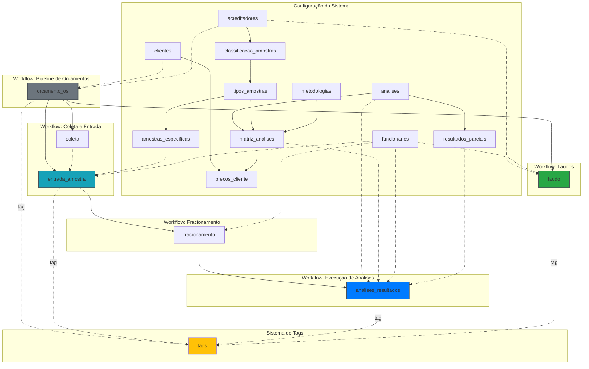

# Documentação Completa: Relacionamentos do Sistema LIMS e Workflow Kanban

## 1. Introdução

### O que é o Sistema LIMS

O **LIMS (Laboratory Information Management System)** é um sistema completo de gestão laboratorial desenvolvido para laboratórios de análises que atendem às normas de acreditação (MAPA, IMA, etc.). O sistema gerencia todo o ciclo de vida de uma análise laboratorial, desde a solicitação do orçamento até a entrega do laudo final.

### Visão Geral do Fluxo Completo

O fluxo operacional do LIMS segue uma sequência lógica e controlada:

1. **Orçamento** → Cliente solicita orçamento para análises
2. **Aprovação** → Cliente aprova e o sistema gera a Ordem de Serviço (OS)
3. **Coleta** (opcional) → Equipe coleta amostras in loco
4. **Entrada** → Amostras são recebidas e conferidas no laboratório
5. **Fracionamento** → Amostras são divididas para análises físico-químicas e microbiológicas
6. **Execução** → Análises são realizadas pelos analistas
7. **Laudo** → Resultados são consolidados, revisados e liberados
8. **Entrega** → Cliente recebe o laudo certificado

Cada etapa é representada visualmente em **quadros Kanban**, onde os cards avançam entre colunas conforme o trabalho progride. O sistema de **tags** registra o estado atual de cada objeto, permitindo rastreabilidade completa.

---

## 2. Arquitetura de Dados

### 2.1. Hierarquias e Estruturas de Classificação

O sistema organiza as amostras em uma hierarquia de 4 níveis, garantindo conformidade com diferentes órgãos certificadores:

```
Acreditadores (MAPA, IMA, ANVISA, etc.)
    └── Classificação de Amostras (Alimentos, Água, Efluentes, etc.)
        └── Tipos de Amostras (Leite Pasteurizado, Água Potável, etc.)
            └── Amostras Específicas (Leite Integral, Leite Desnatado, etc.)
```

**Exemplos práticos:**

- **MAPA** → Alimentos → Leite e Derivados → Leite Pasteurizado Integral
- **IMA** → Água → Água Potável → Água de Consumo Humano
- **ANVISA** → Cosméticos → Cremes → Protetor Solar FPS 50

Esta hierarquia permite:
- Organizar análises por órgão certificador
- Aplicar metodologias específicas por tipo
- Manter padrões de referência adequados
- Precificação diferenciada por categoria

### 2.2. Tabelas de Configuração

Tabelas que armazenam dados mestre e configurações do laboratório:

| Tabela | Descrição | Campos Principais |
|--------|-----------|-------------------|
| **acreditadores** | Órgãos certificadores | nome, sigla, tipo_certificado |
| **classificacao_amostras** | Classificações por acreditador | acreditador (UUID), classificacao |
| **tipos_amostras** | Tipos de amostras por classificação | classificacao (UUID), tipo, temperatura_padrao |
| **amostras_especificas** | Amostras específicas por tipo | tipo_amostra (UUID), nome, codigo |
| **analises** | Catálogo de análises disponíveis | nome_oficial, tipo, tem_parciais, gera_complementar |
| **metodologias** | Métodos de análise | nome, bibliografia, referencia, versao |
| **matriz_analises** | Análise + Tipo de Amostra + Metodologia | analise (UUID), tipo_amostra (UUID), metodologia (UUID), padrao_referencia, valor_base |
| **funcionarios** | Colaboradores do laboratório | nome, funcao, crq, ativo |
| **clientes** | Clientes do laboratório | nome, cpf_cnpj, codigo_sif, codigo_ima, email, telefone |
| **precos_cliente** | Precificação especial | cliente (UUID), matriz_analise (UUID), valor_especial, desconto_percentual, vigencia |
| **resultados_parciais** | Etapas de análises complexas | analise (UUID), nome_parcial, formula, ordem |

### 2.3. Tabelas Transacionais (Workflow)

Tabelas que registram o trabalho realizado e movimentam-se pelo Kanban:

| Tabela | Descrição | Board Kanban | Estados (Tags) |
|--------|-----------|--------------|----------------|
| **orcamento_os** | Orçamentos e Ordens de Serviço | Pipeline de Orçamentos | pendente → enviado → aprovado → os_gerada |
| **coleta** | Coletas de amostras | (Suporte) | N/A |
| **entrada_amostra** | Entrada e conferência de amostras | Fluxo de Amostras | aguardando_coleta → coletada → recebida → fracionada |
| **fracionamento** | Fracionamento de amostras | (Suporte) | N/A |
| **analises_resultados** | Execução de análises | Execução de Análises | aguardando → em_execucao → concluida |
| **laudo** | Laudos técnicos | Aprovação de Laudos | rascunho → revisao_rt → liberado → entregue |

### 2.4. Tabela do Sistema de Tags

A tabela **tags** é o coração do sistema de workflow Kanban:

```sql
CREATE TABLE tags (
    id INTEGER PRIMARY KEY AUTOINCREMENT,
    object_name TEXT NOT NULL,              -- Nome da tabela (ex: "orcamento_os")
    object_id TEXT NOT NULL,                -- UUID do registro
    tag TEXT NOT NULL,                      -- Nome da tag/estado (ex: "pendente")
    applied_at TEXT NOT NULL,               -- Timestamp ISO 8601
    applied_by TEXT NOT NULL,               -- Usuário ou "system"
    UNIQUE(object_name, object_id, tag)     -- Evita tags duplicadas
);
```

**Características:**
- **Independente**: Não usa foreign keys, permite flexibilidade
- **Auditável**: Registra quem e quando aplicou cada tag
- **Único**: Um objeto pode ter apenas uma instância de cada tag
- **Histórico**: Tags removidas são deletadas, mas podem ser arquivadas externamente

---

## 3. Fluxo Completo do Workflow Kanban

### 3.1. Pipeline de Orçamentos (`orcamento_os`)

**Board:** Pipeline de Orçamentos
**Estados:** pendente → enviado → aprovado → os_gerada

#### Campos Principais

| Campo | Tipo | Descrição |
|-------|------|-----------|
| record_id | UUID | Identificador único do orçamento |
| cliente | UUID | Referência ao cliente |
| acreditador | UUID | Órgão certificador (MAPA, IMA, etc.) |
| data_inclusao | Date | Data de criação do orçamento |
| partes | Textarea | Partes interessadas (supervisores, gerentes) |
| qtd_amostras | Number | Quantidade de amostras |
| urgencia | Checkbox | Se há urgência (+50% no valor) |
| valor_coleta | Number | Custo da coleta (se houver) |
| taxa_administrativa | Number | Taxa administrativa do laboratório |
| subtotal | Number | Soma dos valores das análises |
| valor_total | Number | Valor final do orçamento |
| aprovado | Checkbox | Se o cliente aprovou |
| data_aprovacao | Date | Data da aprovação |
| status_tag | Text | Tag atual (sincronizada com tabela tags) |

#### Relacionamentos

- **→ clientes**: Um orçamento pertence a um cliente
- **→ acreditadores**: Orçamento vinculado a um acreditador específico
- **← entrada_amostra**: Um orçamento pode ter várias entradas de amostras
- **← coleta**: Um orçamento pode ter uma ou mais coletas
- **← laudo**: Um orçamento gera um laudo final

#### Transições de Estado

```
┌───────────┐    Enviar para    ┌──────────┐    Cliente     ┌──────────┐    Gerar    ┌────────────┐
│ pendente  │ ──────────────→   │ enviado  │ ────────────→  │ aprovado │ ────────→   │ os_gerada  │
└───────────┘      cliente       └──────────┘     aprova     └──────────┘     OS      └────────────┘
```

**Quando avançar:**

1. **pendente → enviado**: Após calcular valores e enviar proposta ao cliente
2. **enviado → aprovado**: Quando cliente confirma aceitação (marca campo `aprovado`)
3. **aprovado → os_gerada**: Após gerar número de OS e preparar sistema para recebimento

#### Exemplo de Registro

```
record_id: 8f811df0-a3e3-4d2b-b630-114770a7ccb3
cliente: SAAE - Serviço de Água e Esgoto
acreditador: MAPA
qtd_amostras: 2
urgencia: false
valor_total: 450.00
status_tag: pendente
```

---

### 3.2. Fluxo de Amostras (`entrada_amostra`)

**Board:** Fluxo de Amostras
**Estados:** aguardando_coleta → coletada → recebida → fracionada

#### Campos Principais

| Campo | Tipo | Descrição |
|-------|------|-----------|
| record_id | UUID | Identificador único da entrada |
| orcamento_os | UUID | Orçamento/OS relacionado (obrigatório) |
| coleta | UUID | Coleta relacionada (opcional) |
| data_entrada | DateTime | Data/hora de entrada no laboratório |
| recebedor | UUID | Funcionário que recebeu |
| amostra_especifica | UUID | Tipo específico de amostra |
| descricao | Text | Descrição adicional da amostra |
| quantidade | Number | Quantidade recebida |
| temperatura | Number | Temperatura medida (°C) |
| lacre_ok | Checkbox | Se o lacre está íntegro |
| conferido_ok | Checkbox | Se a amostra foi conferida |
| anomalias | Textarea | Registro de anomalias |
| status_tag | Text | Estado atual |

#### Relacionamentos

- **→ orcamento_os**: Entrada sempre vinculada a uma OS
- **→ coleta**: Se houver coleta, referencia o registro
- **→ amostra_especifica**: Define o tipo de amostra
- **→ funcionarios** (recebedor): Quem recebeu a amostra
- **← fracionamento**: Uma entrada pode gerar múltiplos fracionamentos

#### Transições de Estado

```
┌──────────────────┐    Coletar    ┌──────────┐    Receber     ┌──────────┐    Fracionar    ┌─────────────┐
│ aguardando_coleta│ ───────────→  │ coletada │ ────────────→  │ recebida │ ─────────────→  │ fracionada  │
└──────────────────┘                └──────────┘                 └──────────┘                 └─────────────┘
```

**Quando avançar:**

1. **aguardando_coleta → coletada**: Após criar registro em `coleta` com data/hora e coletor
2. **coletada → recebida**: Quando amostra chega ao laboratório e é conferida (marca `conferido_ok`)
3. **recebida → fracionada**: Após criar registros em `fracionamento` para análises físico-químicas e/ou microbiológicas

#### Dependências

- **Criação**: Só pode ser criada se existe um `orcamento_os` com tag `os_gerada`
- **Coleta**: Se `orcamento_os.valor_coleta > 0`, deve ter coleta associada
- **Fracionamento**: Necessário para prosseguir para análises

---

### 3.3. Execução de Análises (`analises_resultados`)

**Board:** Execução de Análises
**Estados:** aguardando → em_execucao → concluida

#### Campos Principais

| Campo | Tipo | Descrição |
|-------|------|-----------|
| record_id | UUID | Identificador único |
| fracionamento | UUID | Fracionamento relacionado |
| analise | UUID | Tipo de análise (ex: Salmonella) |
| matriz_analise | UUID | Análise + Tipo + Metodologia |
| analista | UUID | Funcionário responsável |
| inicio_analise | DateTime | Início da execução |
| termino_analise | DateTime | Término (opcional enquanto em execução) |
| resultado_previo | Text | Resultado preliminar |
| resultado_final | Text | Resultado final |
| conformidade | Select | conforme / nao_conforme / inconclusivo |
| cqi_ok | Checkbox | Controle de Qualidade Interno OK |
| observacoes | Textarea | Observações técnicas |
| status_tag | Text | Estado atual |

#### Relacionamentos

- **→ fracionamento**: Análise feita em uma porção fracionada
- **→ analises**: Tipo de análise executada
- **→ matriz_analises**: Análise + Tipo de Amostra + Metodologia
- **→ funcionarios** (analista): Responsável pela execução
- **→ resultados_parciais**: Se a análise tem etapas parciais

#### Transições de Estado

```
┌─────────────┐    Iniciar     ┌──────────────┐    Finalizar    ┌────────────┐
│ aguardando  │ ────────────→  │ em_execucao  │ ──────────────→ │ concluida  │
└─────────────┘                 └──────────────┘                  └────────────┘
```

**Quando avançar:**

1. **aguardando → em_execucao**: Quando analista registra `inicio_analise` e começa os testes
2. **em_execucao → concluida**: Quando preenche `resultado_final`, `conformidade` e marca `cqi_ok`

#### Dependências

- **Criação**: Requer `fracionamento` com status concluído
- **Matriz**: A combinação analise + tipo_amostra deve existir em `matriz_analises`
- **Metodologia**: Aplicada conforme definido em `matriz_analises`
- **Parciais**: Se `analises.tem_parciais = true`, pode registrar em `resultados_parciais`

#### Relacionamento com Resultados Parciais

Algumas análises complexas (ex: contagem de microrganismos) têm etapas intermediárias:

```sql
-- Exemplo: Análise de Salmonella com resultados parciais
analises_resultados.analise = "Salmonella spp."
  → resultados_parciais (ordem 1): "Pré-enriquecimento (24h)"
  → resultados_parciais (ordem 2): "Enriquecimento seletivo (48h)"
  → resultados_parciais (ordem 3): "Plaqueamento diferencial (72h)"
  → resultado_final: "Ausência em 25g"
```

---

### 3.4. Aprovação de Laudos (`laudo`)

**Board:** Aprovação de Laudos
**Estados:** rascunho → revisao_rt → liberado → entregue

#### Campos Principais

| Campo | Tipo | Descrição |
|-------|------|-----------|
| record_id | UUID | Identificador único |
| orcamento_os | UUID | Orçamento/OS relacionado |
| numero | Text | Número do laudo (ex: MAPA-001/2025) |
| acreditador | UUID | Órgão certificador |
| data_emissao | Date | Data de emissão |
| rt | UUID | Responsável Técnico |
| parecer | Select | conforme / nao_conforme / parcial |
| observacoes | Textarea | Observações do laudo |
| status_tag | Text | Estado atual |

#### Relacionamentos

- **→ orcamento_os**: Laudo consolida resultados de uma OS
- **→ acreditadores**: Define o padrão do certificado
- **→ funcionarios** (rt): Responsável Técnico que assina
- **Implícito → analises_resultados**: Consolida todos os resultados da OS

#### Transições de Estado

```
┌───────────┐    Revisar    ┌─────────────┐    Liberar    ┌───────────┐    Entregar    ┌───────────┐
│ rascunho  │ ───────────→  │ revisao_rt  │ ───────────→  │ liberado  │ ────────────→  │ entregue  │
└───────────┘                └─────────────┘                └───────────┘                └───────────┘
```

**Quando avançar:**

1. **rascunho → revisao_rt**: Após consolidar todos os resultados e gerar PDF preliminar
2. **revisao_rt → liberado**: Quando RT revisa, aprova e assina digitalmente
3. **liberado → entregue**: Após enviar ao cliente (email, portal, etc.)

#### Como os Laudos Consolidam Resultados

O laudo agrega informações de múltiplas fontes:

```
laudo.orcamento_os
  └── entrada_amostra (todas as entradas da OS)
      └── fracionamento (todas as porções)
          └── analises_resultados (todos os resultados)
              → conformidade de cada análise
              → resultado_final de cada análise
                  → laudo.parecer (conforme/não_conforme/parcial)
```

**Regra de Parecer:**
- **Conforme**: Todas as análises são "conforme"
- **Não Conforme**: Pelo menos uma análise é "nao_conforme"
- **Parcial**: Algumas análises "conforme", outras "inconclusivo"

---

## 4. Diagrama de Relacionamentos



### Legenda do Diagrama

- **Linha Sólida (→)**: Relacionamento obrigatório (foreign key conceitual via UUID)
- **Linha Tracejada (-.->)**: Relacionamento opcional ou de referência
- **Cores**:
  - Cinza (#6c757d): Estado inicial
  - Azul claro (#17a2b8): Em processo
  - Azul (#007bff): Em execução
  - Verde (#28a745): Concluído
  - Amarelo (#ffc107): Sistema de controle

---

## 5. Tabelas de Suporte

### 5.1. funcionarios

**Função:** Cadastro de colaboradores do laboratório.

| Campo | Tipo | Descrição | Valores |
|-------|------|-----------|---------|
| nome | Text | Nome completo | - |
| funcao | Select | Função no laboratório | analista, supervisor, rt, coletor, recepcao, administrativo |
| crq | Text | Registro no Conselho Regional de Química | Ex: CRQ-MG 12345 |
| ativo | Checkbox | Se está ativo | true/false |

**Uso no Sistema:**
- **coleta.coletor**: Funcionário que realiza coletas
- **entrada_amostra.recebedor**: Funcionário da recepção
- **fracionamento.responsavel**: Técnico de fracionamento
- **analises_resultados.analista**: Analista responsável
- **laudo.rt**: Responsável Técnico que assina

---

### 5.2. clientes

**Função:** Cadastro de clientes do laboratório.

| Campo | Tipo | Descrição |
|-------|------|-----------|
| nome | Text | Razão social ou nome |
| cpf_cnpj | Text | CPF (pessoa física) ou CNPJ (jurídica) |
| codigo_sif | Text | Código SIF (se indústria de alimentos) |
| codigo_ima | Text | Código IMA (se produtor rural MG) |
| email | Email | E-mail para contato |
| telefone | Tel | Telefone |
| endereco | Text | Endereço completo |
| cidade | Text | Cidade |
| uf | Text | Estado (sigla) |
| cep | Text | CEP |

**Exemplos:**
- SAAE - Serviço de Água e Esgoto
- Laticínios São João
- Distribuidora de Alimentos Bom Sabor

**Uso no Sistema:**
- **orcamento_os.cliente**: Cliente que solicitou o orçamento
- **precos_cliente.cliente**: Precificação especial por cliente

---

### 5.3. acreditadores

**Função:** Órgãos certificadores e normas aplicáveis.

| Campo | Tipo | Descrição | Exemplos |
|-------|------|-----------|----------|
| nome | Text | Nome completo | Ministério da Agricultura, Instituto Mineiro de Agropecuária |
| sigla | Text | Sigla | MAPA, IMA, ANVISA, INMETRO |
| tipo_certificado | Select | Tipo de certificação | oficial, laudo |

**Exemplos:**
- **MAPA** (Ministério da Agricultura): Certificados oficiais para alimentos
- **IMA** (Instituto Mineiro de Agropecuária): Certificados para produtos de origem animal
- **ANVISA**: Laudos para cosméticos e medicamentos

**Uso no Sistema:**
- **orcamento_os.acreditador**: Define qual padrão seguir
- **laudo.acreditador**: Indica qual certificação o laudo tem
- **classificacao_amostras.acreditador**: Hierarquia de amostras por órgão

---

### 5.4. metodologias

**Função:** Métodos analíticos utilizados.

| Campo | Tipo | Descrição | Exemplo |
|-------|------|-----------|---------|
| nome | Text | Nome do método | Contagem de Coliformes Totais |
| bibliografia | Text | Publicação de referência | APHA |
| referencia | Text | Código da norma | 9221 B |
| versao | Text | Versão da norma | 23rd Edition |

**Exemplo Completo:**
```
Nome: Pesquisa de Salmonella spp.
Bibliografia: ISO
Referência: 6579-1:2017
Versão: 2017
```

**Uso no Sistema:**
- **matriz_analises.metodologia**: Método aplicado para cada análise

---

### 5.5. analises

**Função:** Catálogo de análises disponíveis.

| Campo | Tipo | Descrição | Exemplos |
|-------|------|-----------|----------|
| nome_oficial | Text | Nome técnico | Pesquisa de Salmonella spp., Contagem de Coliformes Totais |
| tipo | Select | Categoria | fisico_quimica, microbiologica |
| tem_parciais | Checkbox | Registra resultados intermediários | true para análises longas |
| gera_complementar | Checkbox | Gera análise adicional | true para confirmatórias |
| analise_complementar | UUID | Análise gerada automaticamente | - |

**Exemplo - Análise com Parciais:**
```
Nome: Pesquisa de Salmonella spp.
Tipo: microbiologica
Tem Parciais: true
  → resultados_parciais:
     1. Pré-enriquecimento (24h)
     2. Enriquecimento seletivo (48h)
     3. Plaqueamento diferencial (72h)
```

**Exemplo - Análise com Complementar:**
```
Nome: Contagem Presuntiva de Coliformes
Gera Complementar: true
Análise Complementar: Contagem Confirmatória de Coliformes
```

**Uso no Sistema:**
- **matriz_analises.analise**: Define qual análise
- **analises_resultados.analise**: Análise executada
- **resultados_parciais.analise**: Etapas da análise

---

### 5.6. matriz_analises

**Função:** Combinação Análise + Tipo de Amostra + Metodologia + Precificação.

Esta é a **tabela mais importante para execução**, pois define:
- **O QUE** analisar (analise)
- **EM QUÊ** analisar (tipo_amostra)
- **COMO** analisar (metodologia)
- **PADRÃO** de conformidade (padrao_referencia)
- **PREÇO** base (valor_base)

| Campo | Tipo | Descrição | Exemplo |
|-------|------|-----------|---------|
| analise | UUID | Tipo de análise | Salmonella spp. |
| tipo_amostra | UUID | Tipo de amostra | Leite Pasteurizado |
| metodologia | UUID | Método a aplicar | ISO 6579-1:2017 |
| padrao_referencia | Text | Padrão de conformidade | Ausência em 25g |
| valor_base | Number | Valor base da análise | 85.00 |

**Exemplo Completo:**
```
Análise: Pesquisa de Salmonella spp.
Tipo de Amostra: Leite Pasteurizado
Metodologia: ISO 6579-1:2017
Padrão: Ausência em 25g
Valor Base: R$ 85,00
```

**Uso no Sistema:**
- **analises_resultados.matriz_analise**: Define como executar
- **precos_cliente.matriz_analise**: Preço especial para clientes VIP

---

### 5.7. precos_cliente

**Função:** Precificação especial por cliente (descontos, valores fixos, vigência).

| Campo | Tipo | Descrição |
|-------|------|-----------|
| cliente | UUID | Cliente beneficiado |
| matriz_analise | UUID | Análise com preço especial |
| valor_especial | Number | Valor fixo (sobrescreve valor_base) |
| desconto_percentual | Number | Desconto sobre valor_base (%) |
| vigencia_inicio | Date | Data de início |
| vigencia_fim | Date | Data de término (opcional) |

**Exemplo:**
```
Cliente: SAAE - Serviço de Água e Esgoto
Matriz: Coliformes Totais em Água Potável
Desconto: 15%
Vigência: 2025-01-01 até 2025-12-31
```

**Regra de Cálculo:**
1. Se tem `valor_especial`: usa esse valor
2. Senão, se tem `desconto_percentual`: aplica desconto sobre `matriz_analises.valor_base`
3. Senão: usa `matriz_analises.valor_base`

---

### 5.8. resultados_parciais

**Função:** Define etapas intermediárias de análises complexas.

| Campo | Tipo | Descrição |
|-------|------|-----------|
| analise | UUID | Análise que tem etapas |
| nome_parcial | Text | Nome da etapa |
| formula | Textarea | Fórmula de cálculo (se aplicável) |
| ordem | Number | Ordem de execução |

**Exemplo - Análise de DBO (Demanda Bioquímica de Oxigênio):**
```
Análise: DBO5
  1. Medição inicial de OD (t=0h)
  2. Incubação a 20°C por 5 dias
  3. Medição final de OD (t=120h)
  4. Cálculo: DBO5 = (OD_inicial - OD_final) × diluição
```

**Uso no Sistema:**
- Registrado durante `analises_resultados` com estado `em_execucao`
- Permite rastreamento de etapas longas (5-7 dias)

---

## 6. Sistema de Tags

### 6.1. Como as Tags Representam Estados

No VibeCForms, **tags são estados**. Ao invés de usar uma coluna `status` em cada tabela, o sistema usa uma tabela centralizada `tags` que armazena o estado de qualquer objeto.

**Vantagens:**
- **Auditável**: Registro de quem e quando mudou o estado
- **Flexível**: Novos estados sem alterar schemas
- **Histórico**: Possível guardar tags antigas (não implementado atualmente)
- **Uniforme**: AI agents e humanos usam a mesma interface

### 6.2. Estrutura da Tabela Tags

```sql
CREATE TABLE tags (
    id INTEGER PRIMARY KEY AUTOINCREMENT,
    object_name TEXT NOT NULL,              -- "orcamento_os", "entrada_amostra", etc.
    object_id TEXT NOT NULL,                -- UUID do registro
    tag TEXT NOT NULL,                      -- "pendente", "coletada", etc.
    applied_at TEXT NOT NULL,               -- "2026-01-04T22:41:24.817059"
    applied_by TEXT NOT NULL,               -- "admin@lab.com" ou "system"
    UNIQUE(object_name, object_id, tag)     -- Evita duplicatas
);
```

**Campos:**
- **object_name**: Nome da tabela (form path)
- **object_id**: UUID do registro (campo `record_id`)
- **tag**: Nome do estado (deve corresponder aos estados do Kanban)
- **applied_at**: Timestamp ISO 8601
- **applied_by**: Usuário autenticado ou "system" para operações automáticas

### 6.3. Como as Tags se Relacionam com as 4 Tabelas Principais

Cada tabela transacional do Kanban mantém sincronização com a tabela `tags`:

| Tabela | object_name | Estados Possíveis | Campo Sincronizado |
|--------|-------------|-------------------|--------------------|
| **orcamento_os** | "orcamento_os" | pendente, enviado, aprovado, os_gerada | status_tag |
| **entrada_amostra** | "entrada_amostra" | aguardando_coleta, coletada, recebida, fracionada | status_tag |
| **analises_resultados** | "analises_resultados" | aguardando, em_execucao, concluida | status_tag |
| **laudo** | "laudo" | rascunho, revisao_rt, liberado, entregue | status_tag |

**Sincronização:**
- Ao criar um registro, automaticamente cria a tag inicial
- Ao mover no Kanban, remove tag antiga e adiciona nova
- O campo `status_tag` é atualizado para facilitar queries

**Exemplo de Sincronização:**
```sql
-- Criação de orçamento
INSERT INTO orcamento_os (record_id, ..., status_tag) VALUES ('uuid-123', ..., 'pendente');
INSERT INTO tags (object_name, object_id, tag, applied_at, applied_by)
  VALUES ('orcamento_os', 'uuid-123', 'pendente', '2026-01-05T10:00:00', 'admin@lab.com');

-- Transição pendente → enviado
DELETE FROM tags WHERE object_name='orcamento_os' AND object_id='uuid-123' AND tag='pendente';
INSERT INTO tags (object_name, object_id, tag, applied_at, applied_by)
  VALUES ('orcamento_os', 'uuid-123', 'enviado', '2026-01-05T14:30:00', 'admin@lab.com');
UPDATE orcamento_os SET status_tag='enviado' WHERE record_id='uuid-123';
```

### 6.4. Exemplos de Registros na Tabela Tags

```
id | object_name         | object_id                              | tag                  | applied_at                  | applied_by
---+---------------------+----------------------------------------+----------------------+-----------------------------+-----------
 1 | orcamento_os        | 8f811df0-a3e3-4d2b-b630-114770a7ccb3   | pendente             | 2026-01-04T22:41:24.816052  | system
 2 | orcamento_os        | ace3c1a0-1938-4456-88dc-fc317261cbdb   | enviado              | 2026-01-04T22:41:24.816244  | system
 3 | orcamento_os        | ca189d88-4f97-487b-b51e-40065cf154c8   | aprovado             | 2026-01-04T22:41:24.816255  | system
 4 | orcamento_os        | e5a06174-1a36-447d-9996-f5f345563538   | os_gerada            | 2026-01-04T22:41:24.816261  | system
 5 | entrada_amostra     | 13f4cd4e-5014-4771-a9d3-79968c49bee5   | aguardando_coleta    | 2026-01-04T22:41:24.816498  | system
 6 | entrada_amostra     | 6aaf7942-0c69-4587-9b0f-ae6ff7e38caf   | coletada             | 2026-01-04T22:41:24.816517  | system
 7 | entrada_amostra     | 751270ec-d9e6-49fd-abb0-83a2c9a47ddf   | recebida             | 2026-01-04T22:41:24.816523  | system
 8 | entrada_amostra     | cac0c083-7c7c-422a-99ac-507a3318f69c   | fracionada           | 2026-01-04T22:41:24.816527  | system
 9 | analises_resultados | 04ae0178-bd6c-4569-b0de-900cb48b2fa7   | aguardando           | 2026-01-04T22:41:24.816755  | system
10 | analises_resultados | 8b7bda44-555e-46c8-b499-a47be4fbafcc   | em_execucao          | 2026-01-04T22:41:24.816772  | system
11 | analises_resultados | c11881aa-c3c1-4ce7-a34d-139fb89367c1   | concluida            | 2026-01-04T22:41:24.816778  | system
12 | laudo               | 36c49d0e-e7bb-4788-9a46-1cd32c3565e3   | rascunho             | 2026-01-04T22:41:24.817037  | system
13 | laudo               | 372b3e2d-b608-482f-a860-89976a4f52ed   | revisao_rt           | 2026-01-04T22:41:24.817050  | system
14 | laudo               | 5d74ebc4-d812-4d53-972e-6180f583cc3e   | liberado             | 2026-01-04T22:41:24.817055  | system
15 | laudo               | 8ed4014c-cbec-450c-aefa-3bd38ad33c04   | entregue             | 2026-01-04T22:41:24.817059  | system
```

---

## 7. Fluxo Ponta a Ponta - Exemplo Prático

Vamos acompanhar um caso completo do início ao fim:

### 7.1. Cliente Solicita Orçamento

**Ação:** Cliente SAAE solicita análises de água potável (2 amostras).

```sql
-- 1. Criar orçamento
INSERT INTO orcamento_os (
    record_id, cliente, acreditador, data_inclusao, qtd_amostras, urgencia, status_tag
) VALUES (
    '8f811df0-a3e3-4d2b-b630-114770a7ccb3',
    'f1c89bb5-d12b-48cd-b6e9-86bed965550f',  -- SAAE
    '7ad2eed5-1323-4876-8be3-be1818f83087',  -- MAPA
    '2025-12-22',
    2,
    false,
    'pendente'
);

-- 2. Tag automática
INSERT INTO tags (object_name, object_id, tag, applied_at, applied_by)
VALUES ('orcamento_os', '8f811df0-a3e3-4d2b-b630-114770a7ccb3', 'pendente', '2025-12-22T09:30:00', 'system');
```

**Estado do Kanban:**
```
Pipeline de Orçamentos:
┌──────────────────────┐  ┌─────────┐  ┌─────────┐  ┌──────────┐
│ [Orçamento SAAE #01] │  │         │  │         │  │          │
│ 2 amostras - Água    │  │         │  │         │  │          │
└──────────────────────┘  └─────────┘  └─────────┘  └──────────┘
    Pendente                Enviado       Aprovado     OS Gerada
```

---

### 7.2. Orçamento Aprovado

**Ação:** Administrativo calcula valores e envia ao cliente. Cliente aprova.

```sql
-- 1. Atualizar orçamento e enviar
UPDATE orcamento_os SET
    valor_coleta = 150.00,
    taxa_administrativa = 50.00,
    subtotal = 450.00,
    valor_total = 650.00,
    status_tag = 'enviado'
WHERE record_id = '8f811df0-a3e3-4d2b-b630-114770a7ccb3';

-- 2. Mover tag
DELETE FROM tags WHERE object_name='orcamento_os' AND object_id='8f811df0-a3e3-4d2b-b630-114770a7ccb3' AND tag='pendente';
INSERT INTO tags VALUES (NULL, 'orcamento_os', '8f811df0-a3e3-4d2b-b630-114770a7ccb3', 'enviado', '2025-12-22T14:00:00', 'admin@lab.com');

-- 3. Cliente aprova
UPDATE orcamento_os SET
    aprovado = true,
    data_aprovacao = '2025-12-23',
    status_tag = 'aprovado'
WHERE record_id = '8f811df0-a3e3-4d2b-b630-114770a7ccb3';

-- 4. Mover tag
DELETE FROM tags WHERE tag='enviado';
INSERT INTO tags VALUES (NULL, 'orcamento_os', '8f811df0-a3e3-4d2b-b630-114770a7ccb3', 'aprovado', '2025-12-23T10:15:00', 'cliente@saae.com');

-- 5. Gerar OS
UPDATE orcamento_os SET status_tag = 'os_gerada' WHERE record_id = '8f811df0-a3e3-4d2b-b630-114770a7ccb3';
DELETE FROM tags WHERE tag='aprovado';
INSERT INTO tags VALUES (NULL, 'orcamento_os', '8f811df0-a3e3-4d2b-b630-114770a7ccb3', 'os_gerada', '2025-12-23T10:30:00', 'system');
```

**Estado do Kanban:**
```
Pipeline de Orçamentos:
┌─────────┐  ┌─────────┐  ┌─────────┐  ┌──────────────────────┐
│         │  │         │  │         │  │ [Orçamento SAAE #01] │
│         │  │         │  │         │  │ R$ 650,00            │
└─────────┘  └─────────┘  └─────────┘  └──────────────────────┘
  Pendente      Enviado       Aprovado       OS Gerada
```

---

### 7.3. Amostra Coletada

**Ação:** Coletor vai até o SAAE e coleta 2 amostras de água.

```sql
-- 1. Registrar coleta
INSERT INTO coleta (
    record_id, orcamento_os, data_hora, local, coletor, numero_lacre
) VALUES (
    'col-001',
    '8f811df0-a3e3-4d2b-b630-114770a7ccb3',
    '2025-12-24T08:00:00',
    'SAAE - Estação de Tratamento Centro',
    'func-coletor-001',
    'LACRE-2025-001'
);

-- 2. Criar entradas de amostras
INSERT INTO entrada_amostra (
    record_id, orcamento_os, coleta, amostra_especifica, quantidade, temperatura, status_tag
) VALUES
    ('ent-001', '8f811df0-a3e3-4d2b-b630-114770a7ccb3', 'col-001', 'agua-potavel-001', 1000, 22, 'aguardando_coleta'),
    ('ent-002', '8f811df0-a3e3-4d2b-b630-114770a7ccb3', 'col-001', 'agua-potavel-001', 1000, 22, 'aguardando_coleta');

-- 3. Tags
INSERT INTO tags VALUES
    (NULL, 'entrada_amostra', 'ent-001', 'aguardando_coleta', '2025-12-24T08:00:00', 'system'),
    (NULL, 'entrada_amostra', 'ent-002', 'aguardando_coleta', '2025-12-24T08:00:00', 'system');

-- 4. Marcar como coletadas
UPDATE entrada_amostra SET status_tag = 'coletada' WHERE record_id IN ('ent-001', 'ent-002');
DELETE FROM tags WHERE object_name='entrada_amostra' AND tag='aguardando_coleta';
INSERT INTO tags VALUES
    (NULL, 'entrada_amostra', 'ent-001', 'coletada', '2025-12-24T09:00:00', 'func-coletor-001'),
    (NULL, 'entrada_amostra', 'ent-002', 'coletada', '2025-12-24T09:00:00', 'func-coletor-001');
```

**Estado do Kanban:**
```
Fluxo de Amostras:
┌─────────┐  ┌──────────────────┐  ┌─────────┐  ┌────────────┐
│         │  │ [Amostra #001]   │  │         │  │            │
│         │  │ Água SAAE        │  │         │  │            │
│         │  ├──────────────────┤  │         │  │            │
│         │  │ [Amostra #002]   │  │         │  │            │
│         │  │ Água SAAE        │  │         │  │            │
└─────────┘  └──────────────────┘  └─────────┘  └────────────┘
Aguard. Coleta    Coletada         Recebida     Fracionada
```

---

### 7.4. Amostra Fracionada

**Ação:** Amostras chegam ao laboratório, são conferidas e fracionadas.

```sql
-- 1. Receber amostras
UPDATE entrada_amostra SET
    data_entrada = '2025-12-24T10:30:00',
    recebedor = 'func-recepcao-001',
    lacre_ok = true,
    conferido_ok = true,
    status_tag = 'recebida'
WHERE record_id IN ('ent-001', 'ent-002');

-- 2. Tags
DELETE FROM tags WHERE object_name='entrada_amostra' AND tag='coletada';
INSERT INTO tags VALUES
    (NULL, 'entrada_amostra', 'ent-001', 'recebida', '2025-12-24T10:30:00', 'func-recepcao-001'),
    (NULL, 'entrada_amostra', 'ent-002', 'recebida', '2025-12-24T10:30:00', 'func-recepcao-001');

-- 3. Fracionar (2 porções por amostra: 1 física-química, 1 microbiológica)
INSERT INTO fracionamento (record_id, entrada, numero_porcao, tipo_analise, responsavel, data_hora) VALUES
    ('frac-001', 'ent-001', 1, 'fisico_quimica', 'func-tecnico-001', '2025-12-24T11:00:00'),
    ('frac-002', 'ent-001', 2, 'microbiologica', 'func-tecnico-001', '2025-12-24T11:00:00'),
    ('frac-003', 'ent-002', 1, 'fisico_quimica', 'func-tecnico-001', '2025-12-24T11:00:00'),
    ('frac-004', 'ent-002', 2, 'microbiologica', 'func-tecnico-001', '2025-12-24T11:00:00');

-- 4. Marcar como fracionadas
UPDATE entrada_amostra SET status_tag = 'fracionada' WHERE record_id IN ('ent-001', 'ent-002');
DELETE FROM tags WHERE object_name='entrada_amostra' AND tag='recebida';
INSERT INTO tags VALUES
    (NULL, 'entrada_amostra', 'ent-001', 'fracionada', '2025-12-24T11:00:00', 'func-tecnico-001'),
    (NULL, 'entrada_amostra', 'ent-002', 'fracionada', '2025-12-24T11:00:00', 'func-tecnico-001');
```

**Estado do Kanban:**
```
Fluxo de Amostras:
┌─────────┐  ┌─────────┐  ┌─────────┐  ┌──────────────────┐
│         │  │         │  │         │  │ [Amostra #001]   │
│         │  │         │  │         │  │ 2 porções        │
│         │  │         │  │         │  ├──────────────────┤
│         │  │         │  │         │  │ [Amostra #002]   │
│         │  │         │  │         │  │ 2 porções        │
└─────────┘  └─────────┘  └─────────┘  └──────────────────┘
Aguard. Coleta  Coletada    Recebida      Fracionada
```

---

### 7.5. Análises Executadas

**Ação:** Analistas executam análises microbiológicas em cada porção.

```sql
-- 1. Criar registros de análises (Coliformes Totais)
INSERT INTO analises_resultados (
    record_id, fracionamento, analise, matriz_analise, analista, inicio_analise, status_tag
) VALUES
    ('anl-001', 'frac-002', 'analise-coliformes', 'matriz-agua-coliformes', 'func-analista-001', '2025-12-24T14:00:00', 'aguardando'),
    ('anl-002', 'frac-004', 'analise-coliformes', 'matriz-agua-coliformes', 'func-analista-001', '2025-12-24T14:00:00', 'aguardando');

-- 2. Tags
INSERT INTO tags VALUES
    (NULL, 'analises_resultados', 'anl-001', 'aguardando', '2025-12-24T14:00:00', 'system'),
    (NULL, 'analises_resultados', 'anl-002', 'aguardando', '2025-12-24T14:00:00', 'system');

-- 3. Iniciar execução
UPDATE analises_resultados SET status_tag = 'em_execucao' WHERE record_id IN ('anl-001', 'anl-002');
DELETE FROM tags WHERE object_name='analises_resultados' AND tag='aguardando';
INSERT INTO tags VALUES
    (NULL, 'analises_resultados', 'anl-001', 'em_execucao', '2025-12-24T14:30:00', 'func-analista-001'),
    (NULL, 'analises_resultados', 'anl-002', 'em_execucao', '2025-12-24T14:30:00', 'func-analista-001');

-- 4. Concluir (após 48h de incubação)
UPDATE analises_resultados SET
    termino_analise = '2025-12-26T14:30:00',
    resultado_final = 'Ausência em 100mL',
    conformidade = 'conforme',
    cqi_ok = true,
    status_tag = 'concluida'
WHERE record_id IN ('anl-001', 'anl-002');

DELETE FROM tags WHERE object_name='analises_resultados' AND tag='em_execucao';
INSERT INTO tags VALUES
    (NULL, 'analises_resultados', 'anl-001', 'concluida', '2025-12-26T14:30:00', 'func-analista-001'),
    (NULL, 'analises_resultados', 'anl-002', 'concluida', '2025-12-26T14:30:00', 'func-analista-001');
```

**Estado do Kanban:**
```
Execução de Análises:
┌─────────┐  ┌─────────┐  ┌──────────────────┐
│         │  │         │  │ [Análise #001]   │
│         │  │         │  │ Coliformes       │
│         │  │         │  ├──────────────────┤
│         │  │         │  │ [Análise #002]   │
│         │  │         │  │ Coliformes       │
└─────────┘  └─────────┘  └──────────────────┘
 Aguardando   Em Execução      Concluída
```

---

### 7.6. Laudo Gerado e Entregue

**Ação:** RT consolida resultados, revisa e libera laudo.

```sql
-- 1. Criar laudo em rascunho
INSERT INTO laudo (
    record_id, orcamento_os, numero, acreditador, data_emissao, rt, parecer, status_tag
) VALUES (
    'lau-001',
    '8f811df0-a3e3-4d2b-b630-114770a7ccb3',
    'MAPA-001/2025',
    '7ad2eed5-1323-4876-8be3-be1818f83087',  -- MAPA
    '2025-12-27',
    'func-rt-001',
    'conforme',
    'rascunho'
);

INSERT INTO tags VALUES (NULL, 'laudo', 'lau-001', 'rascunho', '2025-12-27T09:00:00', 'system');

-- 2. Enviar para revisão do RT
UPDATE laudo SET status_tag = 'revisao_rt' WHERE record_id = 'lau-001';
DELETE FROM tags WHERE object_name='laudo' AND tag='rascunho';
INSERT INTO tags VALUES (NULL, 'laudo', 'lau-001', 'revisao_rt', '2025-12-27T10:00:00', 'func-administrativo-001');

-- 3. RT revisa e libera
UPDATE laudo SET status_tag = 'liberado' WHERE record_id = 'lau-001';
DELETE FROM tags WHERE object_name='laudo' AND tag='revisao_rt';
INSERT INTO tags VALUES (NULL, 'laudo', 'lau-001', 'liberado', '2025-12-27T14:00:00', 'func-rt-001');

-- 4. Enviar ao cliente
UPDATE laudo SET status_tag = 'entregue' WHERE record_id = 'lau-001';
DELETE FROM tags WHERE object_name='laudo' AND tag='liberado';
INSERT INTO tags VALUES (NULL, 'laudo', 'lau-001', 'entregue', '2025-12-27T15:30:00', 'system');
```

**Estado do Kanban:**
```
Aprovação de Laudos:
┌─────────┐  ┌─────────┐  ┌─────────┐  ┌──────────────────┐
│         │  │         │  │         │  │ [Laudo MAPA-001] │
│         │  │         │  │         │  │ SAAE - Conforme  │
└─────────┘  └─────────┘  └─────────┘  └──────────────────┘
  Rascunho    Revisão RT    Liberado       Entregue
```

---

## 8. Queries Úteis

### 8.1. Listar Todos os Orçamentos Pendentes

```sql
-- Usando tags
SELECT o.record_id, c.nome AS cliente, o.data_inclusao, o.qtd_amostras, o.valor_total
FROM orcamento_os o
JOIN clientes c ON o.cliente = c.record_id
JOIN tags t ON t.object_name = 'orcamento_os' AND t.object_id = o.record_id
WHERE t.tag = 'pendente'
ORDER BY o.data_inclusao;

-- Usando campo sincronizado (mais rápido)
SELECT o.record_id, c.nome AS cliente, o.data_inclusao, o.qtd_amostras, o.valor_total
FROM orcamento_os o
JOIN clientes c ON o.cliente = c.record_id
WHERE o.status_tag = 'pendente'
ORDER BY o.data_inclusao;
```

---

### 8.2. Ver Quais Amostras Estão Aguardando Coleta

```sql
SELECT
    e.record_id,
    c.nome AS cliente,
    ae.nome AS amostra,
    o.data_inclusao AS data_os,
    t.applied_at AS desde
FROM entrada_amostra e
JOIN orcamento_os o ON e.orcamento_os = o.record_id
JOIN clientes c ON o.cliente = c.record_id
JOIN amostras_especificas ae ON e.amostra_especifica = ae.record_id
JOIN tags t ON t.object_name = 'entrada_amostra' AND t.object_id = e.record_id
WHERE t.tag = 'aguardando_coleta'
ORDER BY t.applied_at;
```

---

### 8.3. Ver Análises em Execução

```sql
SELECT
    ar.record_id,
    an.nome_oficial AS analise,
    f.nome AS analista,
    ar.inicio_analise,
    ROUND(JULIANDAY('now') - JULIANDAY(ar.inicio_analise), 1) AS dias_em_execucao
FROM analises_resultados ar
JOIN analises an ON ar.analise = an.record_id
JOIN funcionarios f ON ar.analista = f.record_id
WHERE ar.status_tag = 'em_execucao'
ORDER BY ar.inicio_analise;
```

---

### 8.4. Verificar Laudos para Revisão do RT

```sql
SELECT
    l.record_id,
    l.numero,
    c.nome AS cliente,
    a.sigla AS acreditador,
    l.data_emissao,
    t.applied_at AS enviado_para_revisao
FROM laudo l
JOIN orcamento_os o ON l.orcamento_os = o.record_id
JOIN clientes c ON o.cliente = c.record_id
JOIN acreditadores a ON l.acreditador = a.record_id
JOIN tags t ON t.object_name = 'laudo' AND t.object_id = l.record_id
WHERE t.tag = 'revisao_rt'
ORDER BY t.applied_at;
```

---

### 8.5. Rastrear um Orçamento Completo

```sql
-- Informações gerais
SELECT
    o.record_id,
    c.nome AS cliente,
    a.sigla AS acreditador,
    o.qtd_amostras,
    o.valor_total,
    o.status_tag AS status_atual
FROM orcamento_os o
JOIN clientes c ON o.cliente = c.record_id
JOIN acreditadores a ON o.acreditador = a.record_id
WHERE o.record_id = '8f811df0-a3e3-4d2b-b630-114770a7ccb3';

-- Histórico de tags (estados)
SELECT
    tag,
    applied_at,
    applied_by
FROM tags
WHERE object_name = 'orcamento_os'
  AND object_id = '8f811df0-a3e3-4d2b-b630-114770a7ccb3'
ORDER BY applied_at;

-- Amostras relacionadas
SELECT
    e.record_id,
    ae.nome AS amostra,
    e.data_entrada,
    e.status_tag
FROM entrada_amostra e
JOIN amostras_especificas ae ON e.amostra_especifica = ae.record_id
WHERE e.orcamento_os = '8f811df0-a3e3-4d2b-b630-114770a7ccb3';

-- Análises realizadas
SELECT
    an.nome_oficial AS analise,
    ar.resultado_final,
    ar.conformidade,
    ar.termino_analise
FROM analises_resultados ar
JOIN fracionamento f ON ar.fracionamento = f.record_id
JOIN entrada_amostra e ON f.entrada = e.record_id
JOIN analises an ON ar.analise = an.record_id
WHERE e.orcamento_os = '8f811df0-a3e3-4d2b-b630-114770a7ccb3';

-- Laudo final
SELECT
    l.numero,
    l.parecer,
    l.data_emissao,
    l.status_tag,
    f.nome AS responsavel_tecnico
FROM laudo l
JOIN funcionarios f ON l.rt = f.record_id
WHERE l.orcamento_os = '8f811df0-a3e3-4d2b-b630-114770a7ccb3';
```

---

### 8.6. Relatório de Produtividade por Analista

```sql
SELECT
    f.nome AS analista,
    COUNT(*) AS total_analises,
    SUM(CASE WHEN ar.status_tag = 'concluida' THEN 1 ELSE 0 END) AS concluidas,
    SUM(CASE WHEN ar.status_tag = 'em_execucao' THEN 1 ELSE 0 END) AS em_andamento,
    ROUND(AVG(JULIANDAY(ar.termino_analise) - JULIANDAY(ar.inicio_analise)), 1) AS tempo_medio_dias
FROM analises_resultados ar
JOIN funcionarios f ON ar.analista = f.record_id
WHERE f.funcao = 'analista'
GROUP BY f.record_id, f.nome
ORDER BY total_analises DESC;
```

---

### 8.7. Amostras com Anomalias

```sql
SELECT
    e.record_id,
    c.nome AS cliente,
    ae.nome AS amostra,
    e.data_entrada,
    e.anomalias
FROM entrada_amostra e
JOIN orcamento_os o ON e.orcamento_os = o.record_id
JOIN clientes c ON o.cliente = c.record_id
JOIN amostras_especificas ae ON e.amostra_especifica = ae.record_id
WHERE e.anomalias IS NOT NULL AND e.anomalias != ''
ORDER BY e.data_entrada DESC;
```

---

### 8.8. Dashboard Executivo (Resumo Geral)

```sql
-- Orçamentos por estado
SELECT
    CASE
        WHEN status_tag = 'pendente' THEN 'Pendente'
        WHEN status_tag = 'enviado' THEN 'Aguardando Aprovação'
        WHEN status_tag = 'aprovado' THEN 'Aprovado'
        WHEN status_tag = 'os_gerada' THEN 'Em Execução'
    END AS estado,
    COUNT(*) AS quantidade,
    SUM(valor_total) AS valor_total
FROM orcamento_os
GROUP BY status_tag
ORDER BY
    CASE status_tag
        WHEN 'pendente' THEN 1
        WHEN 'enviado' THEN 2
        WHEN 'aprovado' THEN 3
        WHEN 'os_gerada' THEN 4
    END;

-- Análises por estado
SELECT
    CASE
        WHEN status_tag = 'aguardando' THEN 'Aguardando Início'
        WHEN status_tag = 'em_execucao' THEN 'Em Execução'
        WHEN status_tag = 'concluida' THEN 'Concluída'
    END AS estado,
    COUNT(*) AS quantidade
FROM analises_resultados
GROUP BY status_tag;

-- Laudos por estado
SELECT
    CASE
        WHEN status_tag = 'rascunho' THEN 'Rascunho'
        WHEN status_tag = 'revisao_rt' THEN 'Em Revisão'
        WHEN status_tag = 'liberado' THEN 'Liberado'
        WHEN status_tag = 'entregue' THEN 'Entregue'
    END AS estado,
    COUNT(*) AS quantidade
FROM laudo
GROUP BY status_tag;
```

---

## Conclusão

Este documento apresentou a arquitetura completa do sistema LIMS, destacando:

1. **Hierarquia de dados**: Acreditadores → Classificação → Tipos → Amostras Específicas
2. **Tabelas de configuração**: Dados mestre (clientes, funcionários, metodologias)
3. **Tabelas transacionais**: Workflow Kanban (orçamentos, amostras, análises, laudos)
4. **Sistema de tags**: Representação de estados com auditoria completa
5. **Fluxo completo**: Exemplo ponta a ponta desde o orçamento até a entrega
6. **Queries úteis**: Consultas práticas para operação diária

O sistema foi projetado seguindo os princípios do **VibeCForms**:
- **Convenção sobre Configuração**: Estrutura de dados segue padrões
- **Tags como Estado**: Estados representados por tags auditáveis
- **Kanbans para Transições**: Interface visual para gestão de workflow
- **Interface Uniforme**: Humanos, AI agents e código usam as mesmas tabelas

Esta documentação serve como referência técnica completa para desenvolvedores, analistas de sistemas e administradores do laboratório.
